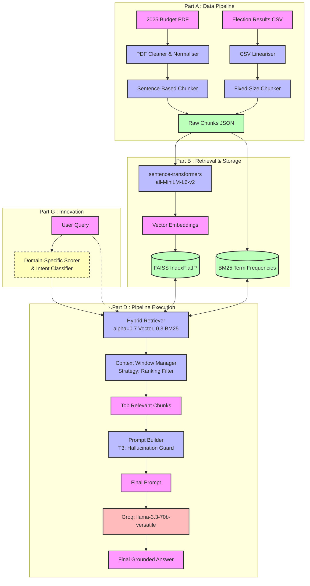

# Part F: Architecture & System Design
**CS4241 Introduction to Artificial Intelligence 2026**
**Student:** Jacqueline Naa Ayima Mensah | **Index:** 10022200119

## 1. System Architecture Diagram

## 2. Component Interaction & Data Flow

1. **Ingestion (Part A):** The user's external documents (PDF and CSV) are parsed. Text is normalised to remove corrupt Unicode characters. Tabular CSV data is converted to semantic row-sentences. 
2. **Chunking (Part A):** The budget PDF is chunked using semantic sentence boundaries, while the Election CSV uses fixed-size chunks to ensure each entire constituency row is embedded uniformly.
3. **Embedding (Part B):** `sentence-transformers` locally maps chunks to a 384-dimensional dense vector space. 
4. **Indexing (Part B):** Embeddings are L2-normalised and stored in a FAISS `IndexFlatIP` (providing exact cosine-similarity search). A parallel BM25 index handles lexical keyword matching.
5. **Innovation Routing (Part G):** The user query is intercepted by the Domain-Specific Scorer. The query is classified into specific domains (e.g., 'election') using heuristics, and chunks belonging to that domain receive an enhanced retrieval multiplier.
6. **Hybrid Fetch (Part D):** The query retrieves the top-K chunks via normalising and combining BM25 keyword scores with FAISS vector similarity (Normalised Linear Combination).
7. **Context Filtration (Part C):** The retrieved chunks pass through the Context Window Manager, which drops any chunks below a confidence threshold (min_score=0.20) and ranks them strictly by relevance.
8. **Generation (Part C/D):** The selected chunks are injected into the *Hallucination Guard Prompt Template*, explicitly forcing the Groq LLM to rely only on the retrieved facts context.
9. **Display (Final Deliverables):** The Streamlit UI displays the query, the retrieved chunks (transparency), the hybrid scores, and the generated RAG response to the end user.

## 3. Justification for the Chosen Domain (Academic City RAG)

This design is uniquely suitable for processing institutional documents (like National Budgets and Election Results) for several reasons:

- **Why Hybrid Search (Vector + BM25)?** 
  Policy documents use synonymous terms (e.g., "fiscal shortfall" = "budget deficit"), requiring vector semantics. However, election data requires exact keyword matches for Constituency names or Candidate codes where embeddings lack distinct boundaries. Hybrid search covers both bases efficiently.
- **Why FAISS `IndexFlatIP`?**
  For an institutional syllabus dataset (<5,000 chunks), approximation indices (like IVF or HNSW) introduce recall degradation without meaningful speed gains. Exhaustive FlatIP search guarantees 100% exact retrieval. L2 normalisation converts dot-product naturally into bounded Cosine Similarity.
- **Why T3 Hallucination Guards?**
  A generic LLM will "leak" external real-world knowledge. When asking a question about a specific year's budget policy, it is imperative the LLM only uses the attached PDF document as facts instead of its generic pre-trained weights.
- **Why Domain Scoring (Innovation)?**
  When queries share mutual crossover vocabulary (e.g. "Who won the region in 2020?"), domain intent classification prevents the budget document's references to 'regions' from disrupting the election retrieval pipeline.
